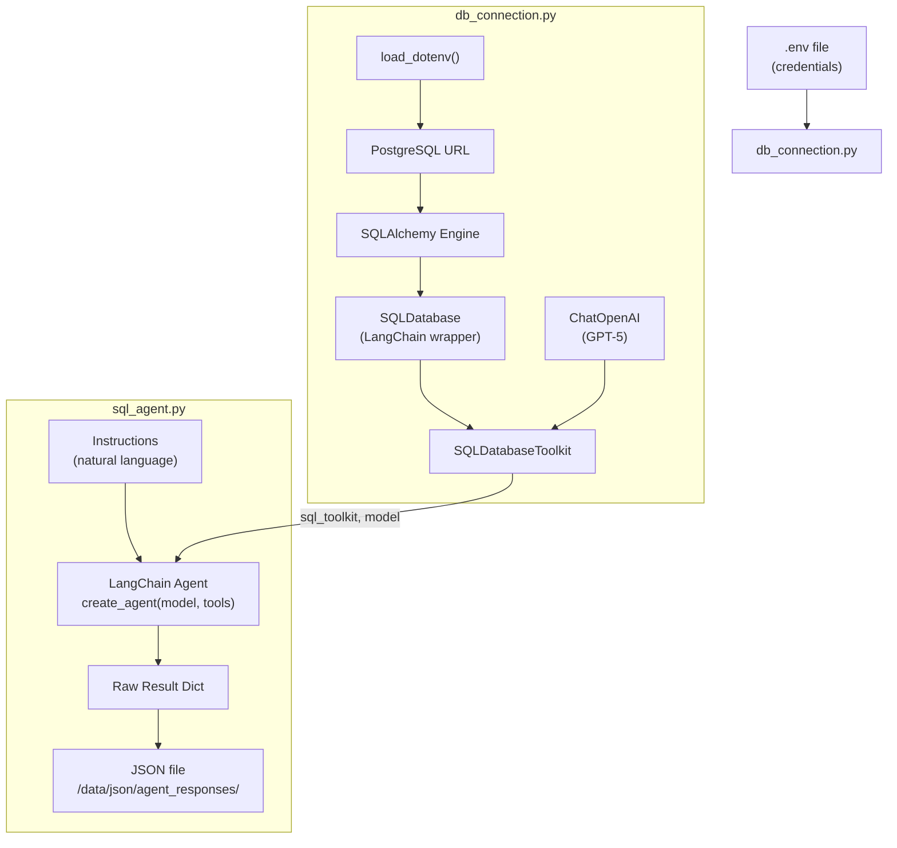
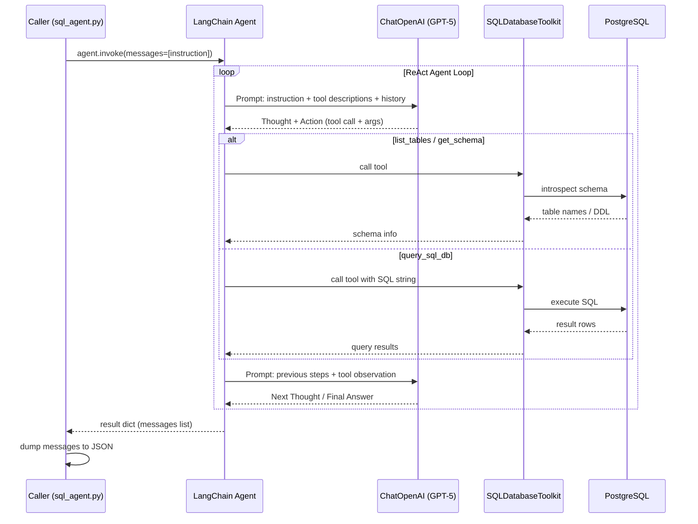

# zaed_sql_agent

A LangChain-powered SQL agent that connects to a PostgreSQL database and answers natural-language questions by generating and executing SQL queries autonomously.

## Overview

The agent accepts plain-English instructions (e.g. *"Find the common customers between the north and south regions"*), decides which SQL tools to call, executes those queries against a live PostgreSQL database, and returns a synthesized answer. Results are persisted as JSON for downstream use.

## Architecture



## LLM Invocation Flow

The agent runs a ReAct-style loop: the LLM reasons about what SQL to execute, calls tools, observes results, and repeats until it has enough information to answer.



## Project Structure

```
zaed_sql_agent/
├── db_connection.py          # DB engine, LangChain SQLDatabase, toolkit & model setup
├── sql_agent.py              # Agent construction, invocation, and JSON export
├── requirements.txt          # Python dependencies
└── data/
    └── json/
        └── agent_responses/
            └── sql_postgres_agent_response.json   # Agent output
```

## Setup

### 1. Install dependencies

```bash
pip install -r requirements.txt
```

### 2. Configure environment variables

Create a `.env` file at `src/mini_projects/data_science_agent/.env` with:

```env
POSTGRES_HOST=localhost
POSTGRES_PORT=5432
POSTGRES_USER=your_user
POSTGRES_PASSWORD=your_password
POSTGRES_DB=your_database
OPENAI_API_KEY=sk-...
```

### 3. Run the agent

```bash
python sql_agent.py
```

Output is printed to stdout and saved to `data/json/agent_responses/sql_postgres_agent_response.json`.

## Key Components

| Component | File | Purpose |
|---|---|---|
| `SQLDatabase` | `db_connection.py` | LangChain wrapper around the SQLAlchemy engine; exposes the DB to tools |
| `ChatOpenAI` | `db_connection.py` | GPT-5 model; reasons over schema and results to form SQL and final answers |
| `SQLDatabaseToolkit` | `db_connection.py` | Bundles tools: list tables, get schema, execute SQL, check queries |
| `create_agent` | `sql_agent.py` | Assembles the ReAct agent from the model and tool list |

## Dependencies

| Package | Role |
|---|---|
| `langchain`, `langchain-core` | Agent framework and core abstractions |
| `langchain-community` | `SQLDatabase` and `SQLDatabaseToolkit` |
| `langchain-openai` | `ChatOpenAI` model integration |
| `langchain-experimental` | Extended agent capabilities |
| `langchain-mcp-adapters` | MCP tool adapter support |
| `fastmcp` | Fast MCP server utilities |
| `sqlalchemy` | Database engine and connection pooling |
| `psycopg2-binary` | PostgreSQL driver |
| `python-dotenv` | `.env` file loader |
